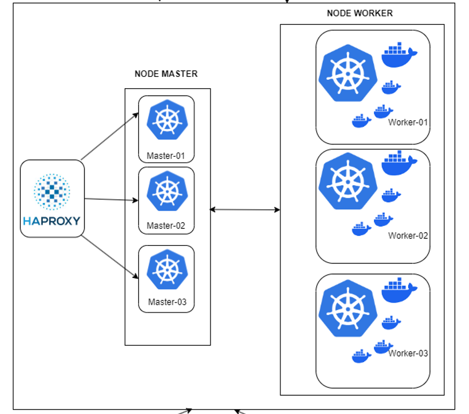

# INSTALLATION KUBERNETES MULTI MASTER
install kubernetes multimaster Ubuntu 20.04 LTS

# ARSITEKTUR (TOPOLOGI)



## set preverse hostname (do all node)
**preserve_hostname** adalah opsi atau pengaturan yang digunakan dalam konfigurasi beberapa distribusi Linux, terutama dalam file konfigurasi **/etc/cloud/cloud.cfg**. Pengaturan ini dapat memiliki nilai true atau false dan mempengaruhi cara hostname sistem dihandle selama proses boot atau provisioning.

Ketika **preserve_hostname** diatur sebagai true, itu berarti sistem akan mempertahankan hostname yang sudah ditetapkan secara manual atau yang diberikan selama proses konfigurasi. Dengan kata lain, meskipun ada konfigurasi atau otomatisasi yang mencoba mengubah hostname selama proses boot, sistem akan mempertahankan nilai hostname yang sudah ada.

Jika preserve_hostname diatur sebagai false, maka sistem dapat mengganti hostname selama proses boot jika ada konfigurasi atau skrip yang mencoba mengatur hostname baru.
```bash
nano /etc/cloud/cloud.cfg
```
search **preserve_hostname** and set *true*</br></br>
preserve_hostname : true

## set the hostname and adjust it to the required hostname (do all node)
```bash
hostnamectl set-hostname {hostname}
```
| HOSTNAME    | IP            | KETERANGAN                               |
| :--------   | :-------      | :----------------------------------------- |
| `lb-master` | `10.10.90.51` | Load balance for kube api-server port 6443 |
| `master-01` | `10.10.90.52` | Controle plane                             |
| `master-02` | `10.10.90.53` | Controle plane                             |
| `master-03` | `10.10.90.54` | Controle plane                             |
| `worker-01` | `10.10.90.55` | Worker                                     |
| `worker-02` | `10.10.90.56` | Worker                                     |
| `worker-03` | `10.10.90.57` | Worker                                     |

## set time (do all node)
```bash
timedatectl set-timezone Asia/Jakarta
```
## set domain local (do all node)
```bash
nano /etc/hosts

  10.10.90.51 lb-master
  10.10.90.52 master-01
  10.10.90.53 master-02
  10.10.90.54 master-03
  10.10.90.55 worker-01
  10.10.90.56 worker-02
  10.10.90.57 worker-03
```

# K8S INSTALLATION (DO ALL MASTER AND WORKER)

## update repository
```bash
apt update
```
## install https Transport
```bash
apt install curl apt-transport-https -y
```
## add api-key official k8s from google
```bash
curl -fsSL  https://packages.cloud.google.com/apt/doc/apt-key.gpg|sudo gpg --dearmor -o /etc/apt/trusted.gpg.d/k8s.gpg
curl -s https://packages.cloud.google.com/apt/doc/apt-key.gpg | sudo apt-key add -
```
## add repository k8s to source list ubuntu
```bash
echo "deb https://apt.kubernetes.io/ kubernetes-xenial main" | sudo tee /etc/apt/sources.list.d/kubernetes.list
```
## update repository just added
```bash
apt update
```
## instal kubectl kubeadm kubelet spceific version (v1.25)
```bash
apt install -y kubeadm=1.25.0-00 kubelet=1.25.0-00 kubectl=1.25.0-00 
```
## Hold all service to keep version 
```bash
apt-mark hold kubelet kubeadm kubectl
```
### System linux configuration ###
## comment swap in fstab
```bash
nano /etc/fstab
``` 
- comment swap.img

```bash
# /etc/fstab: static file system information.
#
# Use 'blkid' to print the universally unique identifier for a
# device; this may be used with UUID= as a more robust way to name devices
# that works even if disks are added and removed. See fstab(5).
#
# <file system> <mount point>   <type>  <options>       <dump>  <pass>
# / was on /dev/ubuntu-vg/ubuntu-lv during curtin installation
/dev/disk/by-id/dm-uuid-LVM-97dj8w1JiawUrjPxBSMmOPPQAcxCp0Unxd76ijKb4JTNISA31NTokVogkj9nr9uZ / ext4 defaults 0 1
# /boot was on /dev/sda2 during curtin installation
/dev/disk/by-uuid/20b8e0ca-52b3-44dd-bcec-26609d5746d1 /boot ext4 defaults 0 1
#/swap.img      none    swap    sw      0       0

## set off swap
```
## set swapoff
```bash
swapoff -a 
mount -a
```
  
## set layer file system
```bash
modprobe overlay
```
## set network bridge
```bash
modprobe br_netfilter
```
## set config layer file system
```bash
tee /etc/modules-load.d/k8s.conf <<EOF
overlay
br_netfilter
EOF
```
## set config bridge network k8s
```bash
tee /etc/sysctl.d/kubernetes.conf<<EOF
net.bridge.bridge-nf-call-ip6tables = 1
net.bridge.bridge-nf-call-iptables = 1
net.ipv4.ip_forward = 1
EOF
```

## apply system bridge and layer
```bash
sysctl --system
```
# INSTALLATION CONTAINERD (DO ALL MASTER AND WORKER)
## add denpedencies and install ca certificate
```bash
apt install -y gnupg2 software-properties-common ca-certificates
```
## add official repository
```bash
curl -fsSL https://download.docker.com/linux/ubuntu/gpg | sudo apt-key add -
add-apt-repository "deb [arch=amd64] https://download.docker.com/linux/ubuntu $(lsb_release -cs) stable"
```
## install containerd
```bash
apt install -y containerd.io
```
## make directory config
```bash
mkdir -p /etc/containerd
```
## add config default containerd
```bash
containerd config default > /etc/containerd/config.toml
```
## restart and enable service containerd
```bash
systemctl restart containerd
systemctl enable containerd
systemctl status containerd
```

# INITIAL MASTER (CONTROL PLANE)

## pull kubernetes image
```bash
kubeadm config images pull
```
## check preflight
```bash
kubeadm init phase preflight
```
## Init Master (only do in one Master node recommend on master-01)
```bash
kubeadm init --control-plane-endpoint="lb-master:6443" --upload-certs --pod-network-cidr=172.16.0.0/16
```
```bash
Result 

Your Kubernetes control-plane has initialized successfully!

To start using your cluster, you need to run the following as a regular user:

  mkdir -p $HOME/.kube
  sudo cp -i /etc/kubernetes/admin.conf $HOME/.kube/config
  sudo chown $(id -u):$(id -g) $HOME/.kube/config

Alternatively, if you are the root user, you can run:

  export KUBECONFIG=/etc/kubernetes/admin.conf

You should now deploy a pod network to the cluster.
Run "kubectl apply -f [podnetwork].yaml" with one of the options listed at:
  https://kubernetes.io/docs/concepts/cluster-administration/addons/

You can now join any number of the control-plane node running the following command on each as root:

  kubeadm join lb-master:6443 --token qm8e6s.fg21m2eijz2yuybi \
        --discovery-token-ca-cert-hash sha256:06ff052ecf66ff5953793daa7625e1ae59352528e2ca72813d4e4e724234a7ea \
        --control-plane --certificate-key 60909e661e90bbb71004df24462d93dc869f3b493c119166e5e4921fc37e5356

Please note that the certificate-key gives access to cluster sensitive data, keep it secret!
As a safeguard, uploaded-certs will be deleted in two hours; If necessary, you can use
"kubeadm init phase upload-certs --upload-certs" to reload certs afterward.

Then you can join any number of worker nodes by running the following on each as root:

kubeadm join lb-master:6443 --token qm8e6s.fg21m2eijz2yuybi \
        --discovery-token-ca-cert-hash sha256:06ff052ecf66ff5953793daa7625e1ae59352528e2ca72813d4e4e724234a7ea
```
## add kubeconfig admin 
```bash
mkdir -p $HOME/.kube
sudo cp -i /etc/kubernetes/admin.conf $HOME/.kube/config
sudo chown $(id -u):$(id -g) $HOME/.kube/config
```
check node by *kubectl get node*

# INITIAL ANOTHER MASTER OR JOINING ANOTHER MASTER (do in master-02 and master-03)
## pull kubernetes image
```bash
kubeadm config images pull
```
## check preflight
```bash
kubeadm init phase preflight
```
## Init Multimaster (do in master-02 and master-03)
```bash
kubeadm join lb-master:6443 --token qm8e6s.fg21m2eijz2yuybi \
        --discovery-token-ca-cert-hash sha256:06ff052ecf66ff5953793daa7625e1ae59352528e2ca72813d4e4e724234a7ea \
        --control-plane --certificate-key 60909e661e90bbb71004df24462d93dc869f3b493c119166e5e4921fc37e5356
```
## add kubeconfig admin 
```bash
mkdir -p $HOME/.kube
sudo cp -i /etc/kubernetes/admin.conf $HOME/.kube/config
sudo chown $(id -u):$(id -g) $HOME/.kube/config
```

# JOIN WORKER TO MASTER (DO IN ALL WORKER)
## join worker
```bash
kubeadm join lb-master:6443 --token qm8e6s.fg21m2eijz2yuybi \
        --discovery-token-ca-cert-hash sha256:06ff052ecf66ff5953793daa7625e1ae59352528e2ca72813d4e4e724234a7ea
```

And then you need to install Network Policy to connect the pods each other link install below
*https://github.com/falyan/install-calico*

## 🔗 Links
[](https://www.linkedin.com/in/falyan-zuril-587585247/)


